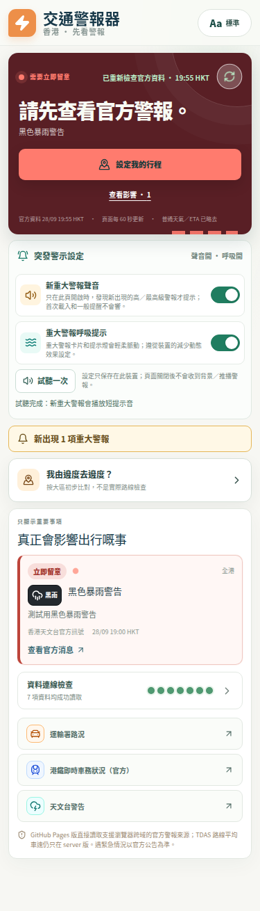

# Alert Effects — implementation and verification report

**Date:** 2026-09-28  
**Scope:** opt-in new-major-alert chime and breathing animation for both the server dashboard and GitHub Pages/static dashboard.  
**Release status:** PR #28 merged and published to the user's GitHub Pages site on 2026-09-29; the public assets were independently verified.

## User-facing behavior

- A compact, collapsed-by-default **「突發警示設定」** disclosure keeps the dashboard uncluttered.
- **「新重大警報聲音」** and **「重大警報呼吸提示」** both default to off. Users explicitly opt in independently.
- Choices persist in local storage under `hk-traffic-alert:alert-effects` on the current browser/device.
- Sound uses the browser Web Audio API only after a user gesture unlocks audio. The test button plays a short three-note chime; a newly observed high/critical alert plays that chime once. Ordinary/watch alerts and alerts already present at first load are silent.
- The dashboard shows a temporary visible notice when a new high/critical alert appears, whether sound is enabled or not. Repeated refreshes of the same alert do not ring again.
- Breathing effects apply to major-alert cards and the incident signal only when enabled. The app honors `prefers-reduced-motion` by turning the animation off even if the preference is enabled.
- These are **foreground-page alerts**, not push notifications. The page must remain open; GitHub Pages does not deliver background notifications.

## Implementation map

- `client/src/lib/alertEffects.ts` — preference defaults/parsing and new-alert deduplication helper.
- `client/src/hooks/useAlertEffects.ts` — browser-storage persistence, first-load baseline, audio activation, chime, deduplicated notices and cleanup.
- `client/src/components/AlertEffectsSettings.tsx` — accessible switch controls and disclosure UI.
- `client/src/pages/Home.tsx` — server dashboard integration; waits for dashboard and road-speed queries to finish their initial load before tracking new alerts.
- `client/src/pages/StaticHome.tsx` — static/GitHub Pages integration; inherits the dashboard's 60-second refresh cycle.
- `client/src/index.css` — responsive controls and preference-gated animations, with a reduced-motion override.
- `client/src/lib/alertEffects.test.ts` — default-off, robust preference parsing and high-impact deduplication tests.
- `reports/assets/alert-effects-375.png` — Playwright screenshot of the built static app at 375px width.

## Verification

- `pnpm pages:build` — passed.
- `pnpm build` — passed; Vite reports the existing large-bundle advisory (>500 kB), but production build succeeds.
- `pnpm test` — **92 tests passed across 11 files**.
- `pnpm check` — passed (`tsc --noEmit`).
- `git diff --check` — passed.
- Playwright against the built static bundle at **375 × 812** — passed: both preferences start off; each can be enabled; local storage records state and restores opt-outs after reload; sound test invokes three note starts; adding a fixture black-rain alert invokes exactly one chime; an unchanged refresh does not replay it; an alert present on initial load is silent; opt-in breathing animates when motion is allowed and is suppressed under reduced motion; no horizontal overflow or uncaught browser errors.

**Test limitation:** the browser test uses a fake `AudioContext` and mocked government-feed responses to deterministically verify Web Audio calls and new-alert detection. It does not claim an acoustic/hardware speaker test or a live incident-feed test. Those are appropriate follow-ups on a real handset or staging environment.

## Handoff notes

- Do not remove the initial-load ID baseline: that would make existing alerts sound like sudden events on page open.
- Keep both defaults false; the product requirement is explicit opt-in for sound **and** motion.
- Do not add browser push/background-notification claims without a separate service-worker permission flow and deployment design.
- Review both dashboard variants when changing alert identifiers, severity definitions, polling cadence or preferences.
- Keep the report's implementation/test notes aligned with the current live release; this feature is deployed, not merely available on the feature branch.

## Release verification

- User explicitly approved merging PR #28 and updating the public GitHub Pages site.
- PR #28 merged into `main` at commit `0b3cff5dfd67a648e3bbeb0fc15b29b6f31a5121`.
- Production static assets from `pnpm pages:build` were published to `gh-pages` at commit `7fa10bdb8bd954073fffda77c5bcea8bbd6e4e47`.
- GitHub Pages deployment workflow [36455311382](https://github.com/cw91020251212/hk-traffic-alert/actions/runs/36455311382) completed successfully.
- Live site: <https://cw91020251212.github.io/hk-traffic-alert/>. The returned HTML referenced `index-RniW6zKx.js` and `index-BDziGqjb.css`; both returned HTTP 200. The deployed JavaScript contained the strings `突發警示設定`, `新重大警報聲音`, and `試聽一次`.

## Mobile preview

